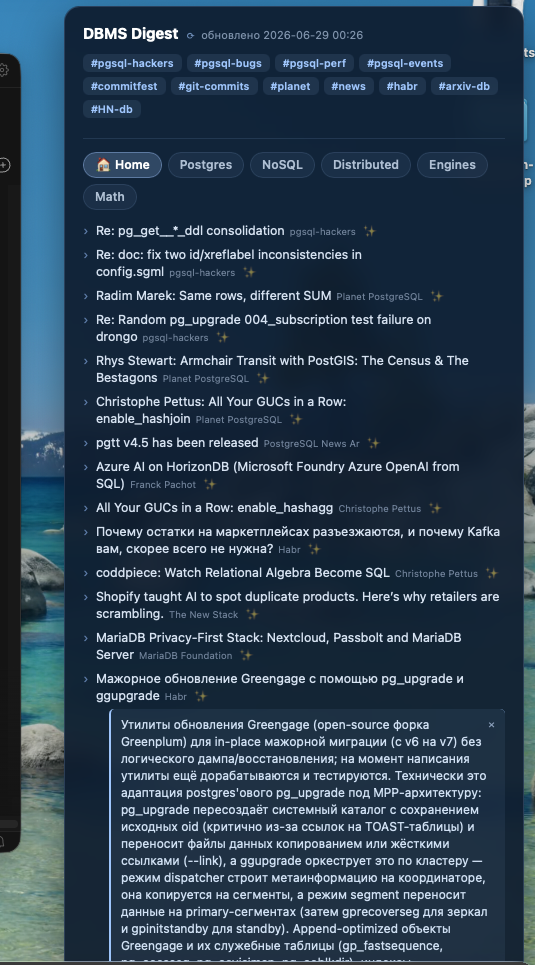

> 🍴 **This is [Alena Rybakina](https://github.com/Alena0704)'s fork of the original
> [danolivo/dbms-digest](https://github.com/danolivo/dbms-digest).** It keeps the upstream weekly
> digest and adds a macOS **Übersicht desktop widget** plus reading tools — described below.

## 🖥️ Desktop widget (added in this fork)

A live PostgreSQL / DBMS news panel for your Mac: topic tabs, expandable channel tags, a 🏠 Home
feed across dozens of sources, and one-click **Claude summaries** that render inline.

  

**What it does**
- **Tabs** — Postgres / NoSQL / Distributed / Engines / Math, each split into
  Новости / Ресёрч / Компании / Личные / Статьи.
- **🏠 Home** — the 15 freshest items across all feeds, de-duplicated and balanced across sources.
- **Tags** — `#pgsql-hackers` · `#pgsql-bugs` · `#commitfest` · `#pgsql-events` · `#planet` ·
  `#habr` · `#git-commits` · `#HN-db` · `#arxiv-db` · `#substack` … click to expand their latest
  items (live RSS + scrapers for channels without a feed).
- **✨ inline summaries** — click ✨ on any item for a short Russian summary from Claude, shown
  right under it. Runs on your **Claude subscription** via the bundled Claude Code CLI — no API key.
- **⟳ refresh** and a **☑ автообновление** (hourly auto-refresh) toggle in the header.

**Buttons & icons**

| Control | What it does |
|---|---|
| **🏠 / topic tabs** (Postgres…) | switch the topic; the row below switches the type (Новости / Ресёрч / …) |
| **#tag** (`#planet`, `#habr`, …) | click to expand that channel's latest items; **✕ свернуть** collapses it |
| **✨** (next to an item) | generate a short Russian Claude summary inline, under the item |
| **✕** (in a summary box) | hide that summary |
| **⟳** (header) | refresh now — clear the cache and refetch immediately |
| **☑ автообновление** (header) | toggle hourly auto-refresh on/off |
| **обновлено …** (header) | timestamp of the last live rebuild |

**How it works** — `index.jsx` runs `build_widget_items.py` (concurrent RSS fetch + page scrapers,
cached ~90 min); ✨ runs `summarize.py` → `claude -p`. Full prerequisites, install, and
customization are in
**[scripts/ubersicht/dbms-digest.widget/README.md](scripts/ubersicht/dbms-digest.widget/README.md)**.

Also added: a terminal reader (`scripts/show_digest.sh` → `digest`), a daily-refresh LaunchAgent,
an always-latest `docs/latest.html` homepage, and an expanded source **catalog + taxonomy**.

---

## 📅 The weekly digest · original project

> Everything below is the upstream content from
> [`danolivo/dbms-digest`](https://github.com/danolivo/dbms-digest), kept as-is in this fork.

### Digests

_Newest first._

- [2026-06-15 — week of Jun 15–21](digests/2026-06-15.md)
- [2026-06-08 — week of Jun 8–14](digests/2026-06-08.md)
- [2026-06-01 — week of Jun 1–7](digests/2026-06-01.md)
- [2026-05-25 — week of May 25–31](digests/2026-05-25.md)
- [2026-05-18 — week of May 18–24](digests/2026-05-18.md)

---

New digests are generated by the `weekly-dbms-digest` skill; see
[`CLAUDE.md`](CLAUDE.md) for the auto-run routine.

**📡 Read it in your feed reader:** subscribe to `https://danolivo.github.io/dbms-digest/feed.xml`
(or open the [landing page](https://danolivo.github.io/dbms-digest/) and tap subscribe).
Each item carries the full digest, so it reads cleanly on a phone.

> **Think you can make the digest sharper?** The generator prompt lives in
> [`.claude/skills/weekly-dbms-digest/SKILL.md`](.claude/skills/weekly-dbms-digest/SKILL.md).
> PRs that improve the curation, filtering, or fact-checking — or add a high-signal source to
> [`sources.md`](.claude/skills/weekly-dbms-digest/references/sources.md) — are very welcome.
